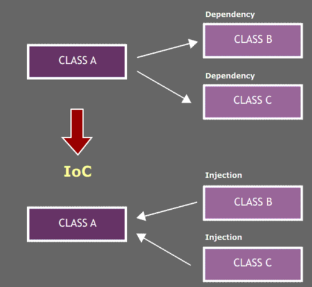
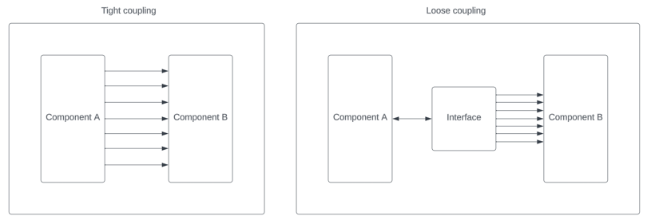

# Unit testing, IoC, Dependency Injection and more!

I want to create a module that will
1. Log the start of training to Snowflake
2. Train model
3. Upload scores into s3
4. Log the completion of training to Snowflake
5. Notify slack channel

## V0
Do everything in one file. No separation of components or anything.
### Pros
- Only have to edit a single file
### Cons
- How do you even begin testing something like this?
  - Need an additional third party dependency like pytest-mock
  - Python's monkey patching actually allows you to do this. But in my experiences with other languages, mocking private and internal functions is extremely difficult.
- Is this scalable? What happens when this single file becomes > 1000 lines of code
## V1
Separation of components to separate files.
### Pros
  - Super simple
  - Separation of components between files
### Cons
  - Still requires monkey patching
  - Dependency is pointing outwards
    - Difficult to manage as more dependencies are added
    - Difficult to manage if spec changes

## IoC

**Inversion of control** - A design principle in which a software component is designed to receive its dependencies from an external source, rather than creating them itself. 

This means that frameworks will depend on abstractions rather than implementation.


## How can we achieve this?
There are many ways!
- Service locator pattern
- Contextualized lookup
- Observer pattern
- Template method 
- Dependency injection
## Dependency injection
Allows an object to supply its dependencies, instead of having them hard-coded or created within the object itself.
```python
class ServiceWithoutDI:
    
    slack = Slack()
    snowflake_db = SnowflakeDB()
    s3 = boto3.client("s3")
    model = Bert4Rec()

    def run(self):
        log = self.snowflake_db.start_training()
        output = self.model.train()
        self.s3.upload("bucket", output)
        self.snowflake_db.complete_training(log)
        self.slack.post_message("#machine-learning", "Generate model scores complete")
        
class ServiceWithDI:

    def __init__(self, slack, snowflake_db, s3, model):
        self.slack = slack
        self.snowflake_db = snowflake_db
        self.s3 = s3
        self.model = model
        
    def run(self):
        log = self.snowflake_db.start_training()
        output = self.model.train()
        self.s3.upload("bucket", output)
        self.snowflake_db.complete_training(log)
        self.slack.post_message("#machine-learning", "Generate model scores complete")
```
## Why do we even care?
IoC helps decouple components in a system, making them more flexible, reusable, and testable

Decoupling - refers to the separation of concerns between components in a system. When components are tightly coupled, they have a strong dependency on each other. Making changes to that component may have a rippling effect on other components.


## V2
Uses dependency injection
### Pros
- Eliminated the need to use monkey patching and pytest-mock
- Mocks can be easily injected into the Service constructor
### Cons
- Service component still has some implementation detail such as using Snowflake, Slack, and S3
## V3
Uses dependency injection + Interfaces
### Pros
- Eliminated the need to even Mock by replacing a fake implementation
- I can easily create different implementations if my use cases change in the future
### Cons
- A lot of files compared to the single file from v0
- Takes a lot of time to understand your system and use cases
- A bit overkill
